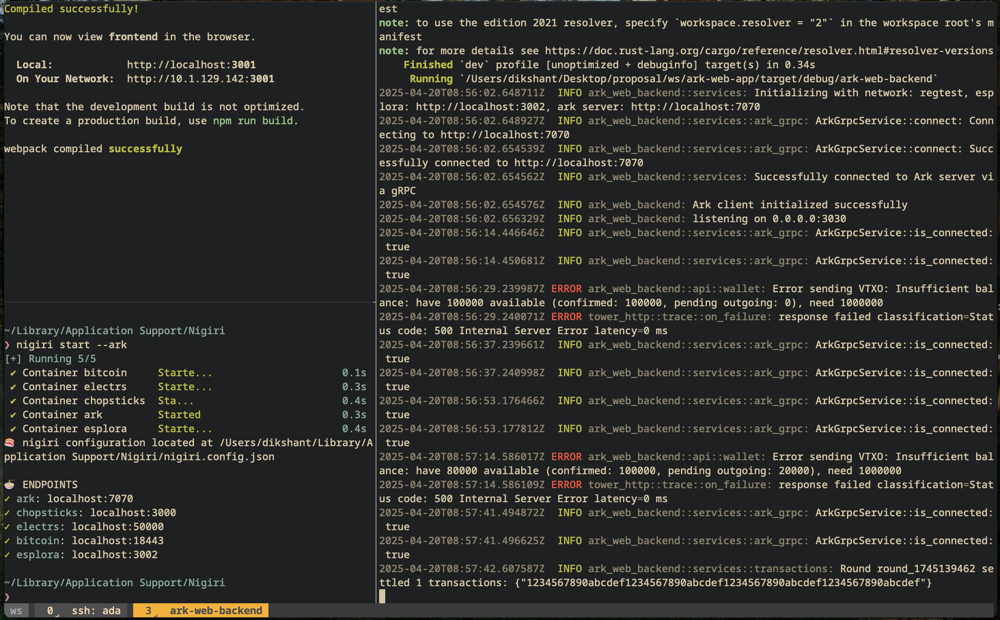

# Arkade Wallet
A Hybrid bitcoin wallet with Ark protocol integration for off-chain transactions.

## overview
Arkade Web Wallet is a full-stack web application that allows users to:
- Create and manage Bitcoin wallets
- Send and receive on-chain Bitcoin transactions
- Send and receive off-chain transactions using the Ark protocol
- View transaction history
- Participate in settlement rounds

The application consists of a Rust backend API and a React frontend, providing a seamless user experience for managing Bitcoin with Ark protocol integration.



## Features
- Wallet Management: Create and access Bitcoin wallets
- On-chain Transactions: Send and receive regular Bitcoin transactions
- Off-chain Transactions: Use the Ark protocol for faster, cheaper transactions
- Transaction History: View all on-chain and off-chain transactions
- Round Participation: Participate in settlement rounds to batch transactions
- Balance Tracking: Monitor confirmed and pending balances
- Address Generation: Generate addresses for receiving funds

## Architecture
### Backend
The backend is built with Rust and provides a RESTful for the frontend and used Grpc to connect with Ark server. It uses:
- Axum: Web framework for handling HTTP requests
- Ark Client: Integration with the Ark protocol
- Bitcoin Development Kit: For Bitcoin wallet functionality
- Tokio: Asynchronous runtime

### Frontend
The frontend is built with React and provides a user-friendly interface. It uses:
- React: JavaScript library for building user interfaces
- React Router: For navigation between pages
- Cloudscape Design System: For UI components
- Fetch API: For communication with the backend

## Getting Started
### Prerequisites
- Rust
- Node.js
- [Nigiri](https://nigiri.vulpem.com/) for server side
To download nigiri run the following command:
```
curl https://getnigiri.vulpem.com | bash
```
by default Nigiri's Esplora frontend client uses a `port-5000:5000` change that to `port-5050:5000`. If using default port numbers for Esplora client update the enviroment variable in backend directory to match your esplora server address.

### Setup
1. Clone the repo 
```
git clone https://github.com/pingu-73/ark-web-app.git
cd ark-web-app
```

2. Start Nigiri with Ark support
```
nigiri start --ark
```

3. Build and run the backend
```
cd backend
cargo build
cargo run
```
The backend will be available at http://localhost:3030

4. Install frontend dependencies and start the development server
```
cd frontend
npm install
npm start
```
The frontend will be available at http://localhost:3000.

## Development
### Backend Development
The backend is structured as follows:
- `src/main.rs`: Entry point and server setup
- `src/api/`: API routes and handlers
- `src/services/`: Business logic
- `src/models/`: Data models

### Frontend Development
The frontend is structured as follows:
- `src/App.js`: Main application component
- `src/pages/`: Page components
- `src/components/`: Reusable UI components
- `src/api/`: API client

# Wallet
## Architecture
### Dual Address System
The wallet uses separate addresses for different purposes:
- **Boarding Address (P2TR)**: `bcrt1p...` - Used exclusively for Ark protocol operations
- **On-Chain Address (P2WPKH)**: `bcrt1q...` - Used for regular Bitcoin transactions
This separation avoids complex Taproot signing issues and provides clear operational boundaries.

####  Why use seperate addresses and not use the same boarding address for onchain tx since it's also a taproot address ?
- **Boarding addresses are 2-of-2 Taproot addresses** shared between user and ark
- **They can receive Bitcoin normally** any Bitcoin sent to a boarding address is recognized by the ASP as entrance into the off-chain system
- **They cannot be spent like normal UTXOs** the boarding address uses a 2-of-2 Taproot script structure i.e spending requires following:
  - timeout-based unilateral spend (after csv dealy expires)
  - cooperative spend (requires ark signature)

**So if I use a boarding address as a "normal" wallet address for general Bitcoin operations, I risk trapping funds**

## Wallet-related routes
|           **Endpoints**          |        **Method**     |            **Handler**           |
|----------------------------------|-----------------------|----------------------------------|
|`/api/wallet/info`                |           GET         |api::wallet::get_info             |
|`/api/wallet/balance`             |           GET         |api::wallet::get_balance          |
|`/api/wallet/address`             | GET (for ark address) |api::wallet::get_address          |
|`/api/wallet/boarding-address`    |           GET         |api::wallet::get_boarding_address |
|`/api/wallet/onchain-address`     |           GET         |api::wallet::get_onchain_address  |
|`/api/wallet/available-balance`   |           GET         |api::wallet::get_available_balance|
|`/api/wallet/send-onchain-payment`|           POST        |api::wallet::send_onchain_payment |
|`/api/wallet/onchain-balance`     |           GET         |api::wallet::get_onchain_balance  |
|`/api/wallet/estimate-fee`        |           POST        |api::wallet::estimate_onchain_fee |
|`/api/wallet/estimate-fee`        |           POST        |api::wallet::estimate_onchain_fee |

## Transaction history & operations routes
|       **Endpoints**       |  **Method**  |            **Handler**           |
|---------------------------|--------------|----------------------------------|
|`/api/transactions`        |      GET     |api::transactions::get_history    |
|`/api/transactions/:txid`  |      GET     |api::transactions::get_transaction|
|`/api/transactions/exit`   |      POST    |api::transactions::unilateral_exit|

## Debug routes 
|   **Endpoints**  |  **Method**  |       **Handler**      |
|------------------|--------------|------------------------|
|`/api/debug/vtxos`|      GET     |api::wallet::debug_vtxos|

<details><summary>API usage examples</summary>


### `GET /api/wallet/boarding-address` 
- Get Ark boarding address (P2TR)

### `GET /api/wallet/onchain-address` 
- Get regular Bitcoin address (P2WPKH)

### `GET /api/wallet/info`
- Returns information about the wallet, including network, server URL, and connection status.

**Example:**
```
~
❯ curl http://localhost:3030/api/wallet/info
{"network":"regtest","server_url":"http://localhost:7070","connected":true}
```

### `GET /api/wallet/onchain-balance` 
- Get on-chain Bitcoin balance

**Example:**

```
curl http://localhost:3030/api/wallet/onchain-balance
{"balance":1000000}

```

### `POST /api/wallet/estimate-fee` 
- Estimate transaction fees

**Example:**

```
❯ curl -X POST http://localhost:3030/api/wallet/estimate-fee \
  -H "Content-Type: application/json" \
  -d '{
    "address": "bcrt1p8qekkwku5lkfkcc5995440sa7m3ep54umspjdyq4d62srrd2v4mqkcrm25",
    "amount": 50000
  }' | jq
  % Total    % Received % Xferd  Average Speed   Time    Time     Time  Current
                                 Dload  Upload   Total   Spent    Left  Speed
100   129  100    21  100   108    505   2600 --:--:-- --:--:-- --:--:--  3146
{
  "estimated_fee": 160
}

```

### `POST /api/wallet/send-onchain-payment` 
- Send Bitcoin to any address

**Example:**
```
❯ curl -X POST http://localhost:3030/api/wallet/send-onchain-payment \
  -H "Content-Type: application/json" \
  -d '{"address": "bcrt1q3ky83a28630z2cl5rsucc9cmnnlen4v2fqsd0k", "amount": 50000}'
{"txid":"c5f10cdb9d8a1219eefebe970d6512ae7b329717a380308c3d15989d7d3cde9e"}

~/Library
❯ nigiri rpc generatetoaddress 1 $(nigiri rpc getnewaddress)
[
    "72c73630a1885a6361359f9906ab59556e3b33bfa34926e67a993f44d3d19612"
]

~/Library
❯ curl http://localhost:3030/api/wallet/onchain-balance
{"balance":949840}

```

### `GET /api/wallet/available-balance`
- Returns the available (confirmed) balance that can be spent.

**Example:**
```
❯ curl http://localhost:3030/api/wallet/available-balance
{"available":1100000}
```

### `GET /api/wallet/balance` 
- Returns the wallet balance, including confirmed, pending, and total amounts.

**Example:**
```
❯ curl http://localhost:3030/api/wallet/balance | jq
  % Total    % Received % Xferd  Average Speed   Time    Time     Time  Current
                                 Dload  Upload   Total   Spent    Left  Speed
100    92  100    92    0     0  24898      0 --:--:-- --:--:-- --:--:-- 30666
{
  "confirmed": 1100000,
  "trusted_pending": 0,
  "untrusted_pending": 0,
  "immature": 0,
  "total": 1100000
}

```

### `GET /api/transactions`
- Returns the transaction history.

**Example:** 
```
❯ curl http://localhost:3030/api/transactions
[{"txid":"a3a1838f320fbd9e02cb8aa808f9308ba07a676a75787e6b8b1387abb3c6a885","amount":100000,"timestamp":1747820540,"type_name":"Boarding","is_settled":true},{"txid":"e3f0b8769a355543307e58ea34c9725330709e61e737e66f45c8149758843316","amount":1000000,"timestamp":1747820900,"type_name":"Boarding","is_settled":true}]
```
</details>

> **NOTE:** Few of the above mentioned API's are still not connected to the frontend. Removal of unused/wrong api's from [main.rs](./backend/src/main.rs) is still remaining.

# Reamining Work
1. **Commit Reveal protocol**
- [ ] Add models for commit and reveal transactions
- [ ] Create API endpoints for the game flow
- [ ] Implement service functions for game logic

2. **Game State Management**
- [ ] Track game states (waiting for commit, waiting for reveal, completed)
- [ ] Handle timeouts and disputes
- [ ] Manage game history

3. **Features**
- [ ] proper random number generation
- [ ] verification of commitments and reveals

4. **Crate with Core functionality for other developers to use**

5. **Features**
- [ ] VTXO Tree Implementation
- [ ] Connector Mechanism (to ensure atomicity b/w forfeit txs and round txs)
- [ ] Timelock Handling (for boarding outputs and unilateral exits)
- [ ] Batch Expiry (track and handle batch expiry for liquidity recycling)

6. **Dummy to real impl**
- [x] make actual gRPC calls to the Ark server for balances, addresses, and tx history
- [x] Receive via on-chain address
- [ ] add signing and verification steps in Round participation

7. **Security Fatures (Improvement from current impl)**
- [x] tx Broadcasting (currently not broadcasting txs to network)
- [x] on-chain tx
- [x] UTXO management
- [x] Key Management
- [ ] Signature Verification
- [ ] Add cryptographic op for protocol's security
- [ ] Implement taproot script with collaborative and exit paths


### Limitations with On-chain tx:
- ~~**Transaction History**: Currently only displays Ark-related transactions. On-chain transaction integration is pending.~~
- **Fee Estimation**: Uses hardcoded minimum fees (160 sats for regtest). Dynamic fee estimation will be implemented.
- **Coin Selection**: Uses largest first algorithm.
